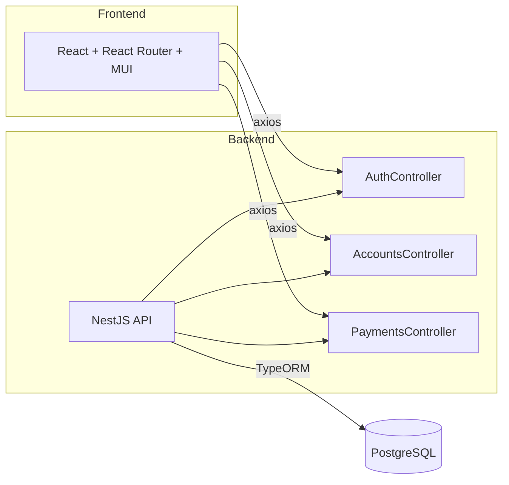

# PayWorld Demo App

  
  
  
  

> A full-stack demo for managing organizations, accounts & payments—built with NestJS, TypeORM, PostgreSQL, React, React Router & MUI.

This is not intended for any actual production use and is not setup to be - this is purely a demonstration
---
 

## Features

- User authentication with JWT + auto-logout on timeout  
- Organizations with multiple / payment accounts  
- CRUD for accounts (add / edit)  
- Each account holds many payments  
- CRUD for payments (create / update status)  
- Unified UI with dialogs prompting each action  
- One-command startup via `npm start` (frontend + backend)  

---

## Tech Stack

- Backend  
  - NestJS + TypeScript  
  - TypeORM  
  - PostgreSQL  
  - JWT authentication  
- Frontend  
  - React  
  - React Router v6  
  - Material UI (MUI)  
  - Axios for HTTP requests  
- Utilities  
  - concurrently (run both servers)  

---

## Architecture Diagram

Installation

# 1. Clone the repo
git clone https://github.com/connorh001/payworld-demo.git
cd pay-world_api

# 2. Install both frontend & backend dependencies
npm install

Environment Variables
Create a .env file in the project root with:

# Backend
DB_HOST=localhost
DB_PORT=5432
DB_USERNAME=postgres
DB_PASSWORD=your_db_password
DB_NAME=payworld_db
JWT_SECRET=your_jwt_secret
JWT_EXPIRATION=3600s

Database Setup
Ensure PostgreSQL is running locally.

Create a database:

psql -U postgres -c "CREATE DATABASE payworld_db;"

Running the App (run this at the root of the project)

npm start

Frontend: http://localhost:3000

Backend: http://localhost:8080/

npm start uses concurrently to launch both servers in one shot.

(side note: i have added docker ymls but couldnt get this running locally yet)

Usage

Open the frontend in your browser.

Register or log in (demo credentials allowed).

Create an organization account.

Add one or more Mock bank/payment accounts.

Click into an account to view/add/approve payments.

Watch your JWT expire after inactivity and re-login.

All interactions happen on the homepage via intuitive dialogs.

To log out simply click the button on the top right . 

Those not signed in are redirected to the login page

Screenshots

License & Disclaimer
This project is strictly for practice and demonstration. Feel free to clone, tinker, and learn—but do not use in production.

Credits 

Massive appreciation to @ https://www.youtube.com/@CyberPotatoDev - for creating such an indepth tutorial playlist on PostgreSQL, Nest, React and more

Can be found here : https://youtube.com/playlist?list=PLDrGjPCkkyttK9JMSr0pkAYCEccG6lXbR

